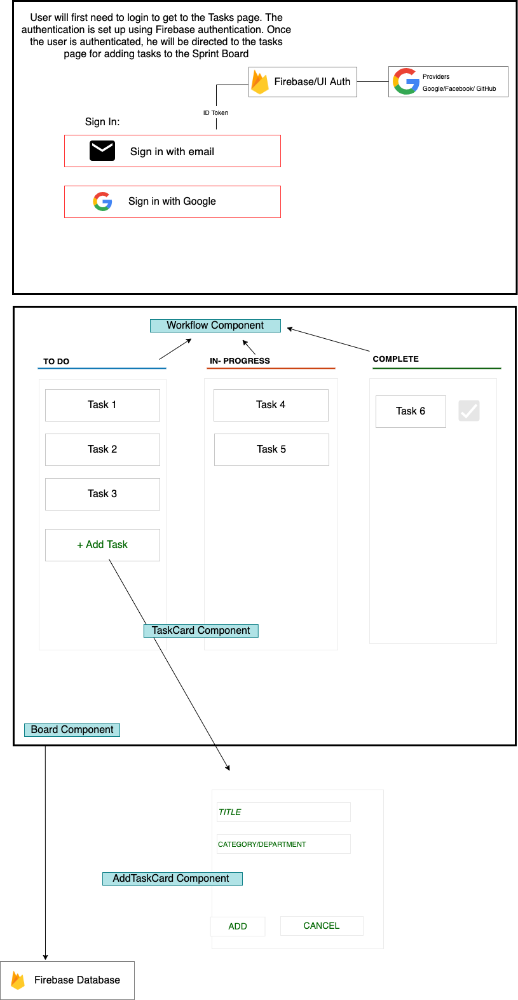

## Name of your project - Sprint Board


My project `Sprint Board` is actually based on a real-life situation of using Kanban boards in various projects across software companies. Kanban boards are `visual task organization tools` that can help manage and oversee the projects' development faster and more accurately. You can move tasks from one column to another with a `drag and drop` action until they are completed. 

Various teams plan short-term assignments aiming on the completion of the project requirements and using this `Sprint Board`, they can keep a track on how many dependencies, incidents, requests or tickets have been logged and completed and then accordingly a plan for the next steps can be decided. A list of tasks can be created and the progress can be tracked. 

The Sprint Board can help visualize work, limit work-in-progress and achieve maximum efficiency. 

**The final webpage will look like the layout shared:**



**Dependencies**

```
  1. React- scripts, dom
  2. prop-types
  3. Firebase
  4. react-beautiful-dnd 
  5. jest
  6. bootstrap
```


**Tasks**


