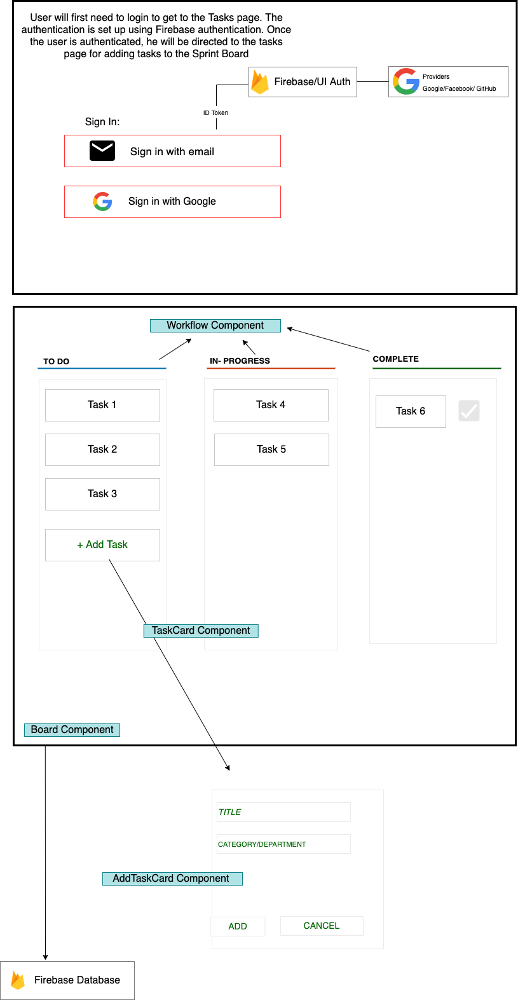

## Name of your project - Sprint Board


My project `Sprint Board` is actually based on a real-life situation of using Kanban boards in various projects across software companies. Kanban boards are `visual task organization tools` that can help manage and oversee the projects' development faster and more accurately. You can move tasks from one column to another with a `drag and drop` action until they are completed. 

Various teams plan short-term assignments aiming on the completion of the project requirements and using this `Sprint Board`, they can keep a track on how many dependencies, incidents, requests or tickets have been logged and completed and then accordingly a plan for the next steps can be decided. A list of tasks can be created and the progress can be tracked. 

The Sprint Board can help visualize work, limit work-in-progress and achieve maximum efficiency. 

**The final webpage will look like the layout shared:**



**Dependencies**

```
  1. React- scripts, dom
  2. prop-types
  3. Firebase
  4. react-beautiful-dnd 
  5. jest
  6. bootstrap
```


**Tasks**

1. A login page to be created using `Firebase Authentication`.
2. The task page will display three different components for the tasks monitored:
    - To-do
    - In-progress
    - Complete
3. Each Task card will have the `Title` and the `Category or the Department` related to it. 
4. `Add Task Card ` functionality needs to be included to add new assignments.
5. Each Task Card needs to include a `drag and drop` functionality for the users to update assignment status. 
6. The completed tasks need to have a check box ticked. 
7. The webpage must store the tasks added using Firebase Database. 
8. The application is deployed and functional. 

**nice to have**

Add a filter to sort task according to the category or department it is related to. 


**Plan**

* May 28- June 3: Create tasks page with each component and render it without error
* June3- June10: Add drag and drop functionality, checkbox and the filter. 
* June 10-June 15: Improve CSS , write unit tests and deploy the project. 


